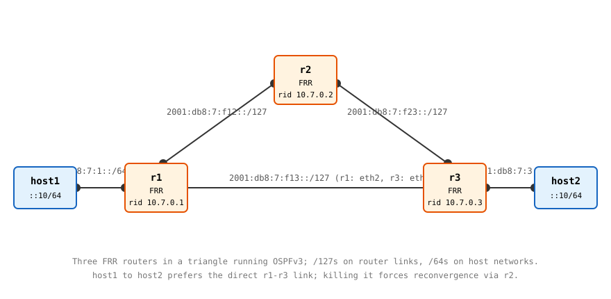

# Lab 1: OSPFv3 Dynamic Routing with FRR

**Before proceeding, complete [Lab 0](./lab0) (FRR image + daemons file) and [Week 7's Lab 1](../../week_07/lab1) (the link-local and static-routing concepts this lab builds on).**

This is the week's main event: three routers you do not give any routes to, discovering the topology themselves. You'll watch adjacencies walk to `Full`, verify the "identical LSDB everywhere" claim directly, trace a route from OSPF through the RIB into the kernel FIB, and then kill the best path mid-ping and measure how long the network takes to heal. Then you'll make it heal faster.

**This lab should be done on the lab host configured for you to have privileged access to.**

## Topology



Addressing plan, all from the documentation prefix. Router-to-router links get /127s (exactly two addresses, the point-to-point convention from [RFC 6164](https://datatracker.ietf.org/doc/html/rfc6164)); host networks get /64s:

| Network | Prefix | Assignments |
|---|---|---|
| host1 LAN | `2001:db8:7:1::/64` | r1 `::1`, host1 `::10` |
| host2 LAN | `2001:db8:7:3::/64` | r3 `::1`, host2 `::10` |
| r1-r2 link | `2001:db8:7:f12::/127` | r1 `::0`, r2 `::1` |
| r1-r3 link | `2001:db8:7:f13::/127` | r1 `::0`, r3 `::1` |
| r2-r3 link | `2001:db8:7:f23::/127` | r2 `::0`, r3 `::1` |

Router IDs are `10.7.0.1`, `10.7.0.2`, `10.7.0.3`. These are 32-bit OSPF identifiers, not addresses; nothing IPv4 is routed anywhere in this lab.

## Step 0: Prepare the work directory

```bash
mkdir -p $HOME/container-lab/stretch-ospfv3/lab1
cd $HOME/container-lab/stretch-ospfv3/lab1
cp ../daemons .   # the file written in Lab 0
```

## Step 1: Write the router configs

One `frr.conf` per router. The pattern is identical across all three: addresses live on interfaces, `ipv6 ospf6 area 0.0.0.0` enrolls each interface into OSPF area 0, and the `router ospf6` block sets the router ID. `log stdout` makes protocol events visible in `docker logs`, which the failure step uses.

<details>
<summary>Show <code>r1-frr.conf</code> contents</summary>

```
frr defaults traditional
hostname r1
log stdout informational
!
interface eth1
 ipv6 address 2001:db8:7:f12::/127
 ipv6 ospf6 area 0.0.0.0
!
interface eth2
 ipv6 address 2001:db8:7:f13::/127
 ipv6 ospf6 area 0.0.0.0
!
interface eth3
 ipv6 address 2001:db8:7:1::1/64
 ipv6 ospf6 area 0.0.0.0
!
router ospf6
 ospf6 router-id 10.7.0.1
!
```

</details>

<details>
<summary>Show <code>r2-frr.conf</code> contents</summary>

```
frr defaults traditional
hostname r2
log stdout informational
!
interface eth1
 ipv6 address 2001:db8:7:f12::1/127
 ipv6 ospf6 area 0.0.0.0
!
interface eth2
 ipv6 address 2001:db8:7:f23::/127
 ipv6 ospf6 area 0.0.0.0
!
router ospf6
 ospf6 router-id 10.7.0.2
!
```

</details>

<details>
<summary>Show <code>r3-frr.conf</code> contents</summary>

```
frr defaults traditional
hostname r3
log stdout informational
!
interface eth1
 ipv6 address 2001:db8:7:f13::1/127
 ipv6 ospf6 area 0.0.0.0
!
interface eth2
 ipv6 address 2001:db8:7:f23::1/127
 ipv6 ospf6 area 0.0.0.0
!
interface eth3
 ipv6 address 2001:db8:7:3::1/64
 ipv6 ospf6 area 0.0.0.0
!
router ospf6
 ospf6 router-id 10.7.0.3
!
```

</details><br />

## Step 2: Write the topology file

<details>
<summary>Show <code>lab1.clab.yml</code> contents</summary>

```yaml
name: ospfv3-lab1
topology:
  nodes:
    r1:
      kind: linux
      image: quay.io/frrouting/frr:10.6.1
      binds:
        - daemons:/etc/frr/daemons
        - r1-frr.conf:/etc/frr/frr.conf
      exec:
        - sysctl -w net.ipv6.conf.all.forwarding=1
    r2:
      kind: linux
      image: quay.io/frrouting/frr:10.6.1
      binds:
        - daemons:/etc/frr/daemons
        - r2-frr.conf:/etc/frr/frr.conf
      exec:
        - sysctl -w net.ipv6.conf.all.forwarding=1
    r3:
      kind: linux
      image: quay.io/frrouting/frr:10.6.1
      binds:
        - daemons:/etc/frr/daemons
        - r3-frr.conf:/etc/frr/frr.conf
      exec:
        - sysctl -w net.ipv6.conf.all.forwarding=1
    host1:
      kind: linux
      image: nettools:week05
      exec:
        - ip -6 addr add 2001:db8:7:1::10/64 dev eth1
        - ip -6 route add 2001:db8:7::/48 via 2001:db8:7:1::1
    host2:
      kind: linux
      image: nettools:week05
      exec:
        - ip -6 addr add 2001:db8:7:3::10/64 dev eth1
        - ip -6 route add 2001:db8:7::/48 via 2001:db8:7:3::1
  links:
    - endpoints: ["r1:eth1", "r2:eth1"]
    - endpoints: ["r1:eth2", "r3:eth1"]
    - endpoints: ["r2:eth2", "r3:eth2"]
    - endpoints: ["r1:eth3", "host1:eth1"]
    - endpoints: ["r3:eth3", "host2:eth1"]
```

</details><br />

The link order matters: ContainerLab numbers each node's interfaces in the order its links appear, so this list is what makes `r1`'s `eth2` face `r3` the way the configs assume. Note also what the host `exec` blocks do *not* contain: no route to the far side's specific /64. Each host knows one thing: the whole lab prefix (`2001:db8:7::/48`) lives past its router. Everything between the routers is OSPF's problem. (The route is a /48 rather than a default because ContainerLab's management interface already owns each node's default route; Week 7's Lab 1 Step 6 has the full story.)

## Step 3: Deploy and meet vtysh

```bash
containerlab deploy -t lab1.clab.yml
docker exec -it clab-ospfv3-lab1-r1 vtysh
```

You're now in FRR's CLI, the dialect ancestor of every router shell you'll use this summer. Prompts and `?`-completion work the way Juniper's and Arista's do. Start with:

```
show ipv6 ospf6 neighbor
```

Within about 40 seconds of deploy you should see two neighbors (`10.7.0.2` and `10.7.0.3`), each in state `Full`. If you catch the lab early enough you may see `ExStart` or `Loading` mid-handshake: the state machine from the [Objectives](./objectives), live. The column showing `DR`/`BDR` roles is the designated-router election that multi-access segments perform; with exactly two routers per link here, every link elects one of each.

**Question:** these adjacencies formed while the only addresses on the router links were configured GUAs and automatic link-locals, with no routes anywhere yet. Which address family are the hellos actually being exchanged over? Verify: `show ipv6 ospf6 neighbor detail` shows each neighbor's actual address. Compare it to Week 7 Lab 1's Step 3.

## Step 4: Verify the link-state claim

The objectives called "every router holds an identical LSDB" a checkable claim. Check it:

```bash
docker exec -it clab-ospfv3-lab1-r1 vtysh -c 'show ipv6 ospf6 database'
docker exec -it clab-ospfv3-lab1-r2 vtysh -c 'show ipv6 ospf6 database'
docker exec -it clab-ospfv3-lab1-r3 vtysh -c 'show ipv6 ospf6 database'
```

Same LSA types, same advertising router IDs, same set, on all three, including `r2` which has no host networks of its own. Each router contributed only its own local links, and flooding did the rest.

## Step 5: Follow one route from protocol to kernel

Pick `host2`'s network, `2001:db8:7:3::/64`, and find it on `r1` at each stage of the pipeline:

```bash
docker exec -it clab-ospfv3-lab1-r1 vtysh -c 'show ipv6 ospf6 route'
docker exec -it clab-ospfv3-lab1-r1 vtysh -c 'show ipv6 route 2001:db8:7:3::/64'
docker exec -it clab-ospfv3-lab1-r1 ip -6 route show 2001:db8:7:3::/64
```

The first is OSPF's own view. The second is the RIB: the route carries an `O` (OSPF) marker and FRR's `[110/20]` notation, administrative distance 110 and total cost 20. The third is the kernel FIB, the route zebra actually installed. Two observations to make before moving on:

- **The next-hop in every view is an `fe80::` link-local address**, exactly as [Week 7 Lab 1's](../../week_07/lab1) Step 6 previewed. No global router address appears in the forwarding path at all.
- **The cost is 20**: r1's interface toward r3 (10) plus r3's interface toward host2's LAN (10). The alternative through r2 would cost 30, so it lost SPF and appears nowhere in the FIB.

**Question:** run the same three commands on `r2`. Its best path to `2001:db8:7:3::/64` costs 20 as well. Through which interface, and why is there exactly one entry rather than two?

## Step 6: Prove it end-to-end

```bash
docker exec -it clab-ospfv3-lab1-host1 ping -c 3 2001:db8:7:3::10
docker exec -it clab-ospfv3-lab1-host1 traceroute -6 2001:db8:7:3::10
```

Two router hops: `r1`, then `r3`, then the destination. The direct link is carrying the traffic, and nobody typed a route to make that happen.

## Step 7: Kill the best path and measure the healing

Start a continuous ping with timestamps from `host1`, in its own terminal:

```bash
docker exec -it clab-ospfv3-lab1-host1 ping -i 0.2 2001:db8:7:3::10
```

While it runs, drop the direct r1-r3 link from a second terminal, and watch `r1`'s protocol log react:

```bash
docker exec -it clab-ospfv3-lab1-r1 ip link set eth2 down
docker exec clab-ospfv3-lab1-r1 sh -c 'sleep 2' && docker logs --tail 20 clab-ospfv3-lab1-r1
```

In the ping terminal, count the missed replies before responses resume, then check `traceroute -6` again: three router hops now, through `r2`. Because downing one end of a veth pair drops carrier at *both* ends, each router noticed instantly, flooded updated LSAs, re-ran SPF, and installed the detour. Expect an outage of a second or two at worst.

Bring it back and watch the traffic return to the better path (better paths preempt; nothing "sticks" to the detour):

```bash
docker exec -it clab-ospfv3-lab1-r1 ip link set eth2 up
```

**Question:** compare `show ipv6 route 2001:db8:7:3::/64` on `r1` during the outage versus after recovery: cost 30 versus cost 20. What single fact changed in the LSDB in each direction?

## Step 8: The silent failure, and why timers exist

Step 7's failure was loud: carrier dropped, both routers knew immediately, and the hello/dead timers never entered the picture. Real failures are frequently silent: a switch between the routers dies, an optic fails in one direction (recall Week 6), and carrier stays up while packets stop arriving. Detection then falls entirely to the dead interval. Inspect the current timers:

```bash
docker exec -it clab-ospfv3-lab1-r1 vtysh -c 'show ipv6 ospf6 interface eth2'
```

Hello 10, dead 40: FRR's defaults, meaning a silent failure black-holes traffic for up to 40 seconds. To observe it, make the failure silent by inserting a plain L2 relay between r1 and r3 so that killing the far segment leaves r1's carrier up. That requires a topology change, so it's structured as the bonus below. What you can do right now is shrink the window. On **both** ends of the r1-r3 link (timers must match, or the adjacency drops entirely):

```bash
docker exec -it clab-ospfv3-lab1-r1 vtysh -c 'conf t' -c 'interface eth2' -c 'ipv6 ospf6 hello-interval 1' -c 'ipv6 ospf6 dead-interval 4'
docker exec -it clab-ospfv3-lab1-r3 vtysh -c 'conf t' -c 'interface eth1' -c 'ipv6 ospf6 hello-interval 1' -c 'ipv6 ospf6 dead-interval 4'
```

Re-run `show ipv6 ospf6 interface eth2` and confirm the new values, and confirm the adjacency survived the change (`show ipv6 ospf6 neighbor`).

**Questions:**
- Between changing the first router's timers and the second's, the two ends briefly disagreed, yet the adjacency survived. How long could that window safely last before it wouldn't have? (Hint: which timer was still 40s on one side?)
- What does 1s/4s cost in steady state, on a router with 200 OSPF interfaces? At what point does the objectives' BFD mention stop being an aside and start being the design?

## Step 9: Clean up

```bash
containerlab destroy -t lab1.clab.yml --cleanup
```

---

## Bonus challenge: make the failure actually silent

Extend the topology with a sixth node, `relay`, a `nettools:week05` container bridging two interfaces at L2 (the same `ip link add br0 type bridge` pattern the VXLAN stretch topic uses), inserted into the r1-r3 path: `r1:eth2` connects to `relay:eth1`, and `relay:eth2` connects to `r3:eth1`. The routers' configs don't change at all; they can't tell the relay is there.

Now reproduce Step 7's experiment, but instead of downing `r1`'s interface, down the relay's *far* port: `docker exec clab-ospfv3-lab1-relay ip link set eth2 down`. `r1` keeps carrier and suspects nothing; hellos just stop arriving.

- With default 10/40 timers, how many seconds of ping loss do you measure before the detour installs? Compare it against the dead interval.
- Repeat with the 1s/4s timers from Step 8. Does the measured outage track the new dead interval the way the objectives' interactive widget predicts?
- `r3`'s side of that link lost carrier immediately (its veth to the relay stayed up; only the far segment died... verify this with `ip link` on r3 before assuming). Which router flooded the topology change first, and did it matter to the healing time?

## Final questions

- Add a second parallel link between r1 and r3 (a new veth pair, addressed from a fresh /127, enrolled in area 0 with the same cost). What does `show ipv6 route 2001:db8:7:3::/64` on r1 show now, and what Week 4 concept is FRR doing at the FIB level?
- In `vtysh` on r1, add `ipv6 route 2001:db8:7:3::/64 2001:db8:7:f12::1` (a static route via r2; note staticd would need enabling in the daemons file: check `show ipv6 route` first and explain what you find either way). With both a static and an OSPF route present for the same prefix, which wins, and what number decided it?
- The daemons file has carried `bgpd=no` through this whole lab. Looking at how this topic's pieces fit (loopbacks, an IGP maintaining reachability, RIB arbitration), why does iBGP conventionally peer between loopback addresses rather than physical interface addresses, and whose job is it to keep those loopbacks reachable?
