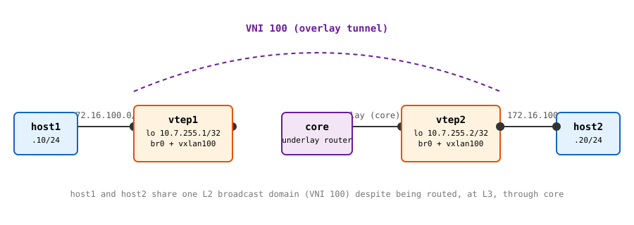

# Lab 1: VXLAN Flood-and-Learn

**Before proceeding, complete [Lab 0](./lab0) to build `nettools:vxlan` and confirm the host kernel's `vxlan` module is loaded.**

This lab builds two VTEPs, `vtep1` and `vtep2`, connected only through an L3-routed underlay (`core`) that has no idea VXLAN is running on top of it. `host1` and `host2` sit behind `vtep1` and `vtep2` respectively, on the same tenant subnet. Despite being routed through `core` at the underlay level, they should behave as if they're on the same wire.

**This lab should be done on the lab host configured for you to have privileged access to.**

## Topology



- **Underlay** (routed, VXLAN has no visibility into this): `vtep1` (`10.7.255.1/32` on `lo`) and `vtep2` (`10.7.255.2/32` on `lo`) each reach `core` over a `/30`, and `core` routes between the two loopbacks.
- **Overlay** (VNI 100): `host1` (`172.16.100.10/24`) and `host2` (`172.16.100.20/24`) sit on `vtep1`'s and `vtep2`'s access-side bridges. No IP is configured on the bridge itself, since this is a pure L2 extension.
- No IP multicast is used in the underlay. Each VTEP maintains a static **head-end replication** list (an all-zero-MAC FDB entry per remote VTEP) instead; see [Vincent Bernat's VXLAN & Linux](./resources) for the same technique against a real reference.

## Step 0: Prepare the work directory

```bash
mkdir -p $HOME/container-lab/stretch-vxlan/lab1
cd $HOME/container-lab/stretch-vxlan/lab1
```

## Step 1: Write the topology file

<details>
<summary>Show <code>lab1.clab.yml</code> contents</summary>

```yaml
name: vxlan-lab1
topology:
  nodes:
    host1:
      kind: linux
      image: nettools:vxlan
      exec:
        - ip addr add 172.16.100.10/24 dev eth1
        - ip link set dev eth1 mtu 1500
    vtep1:
      kind: linux
      image: nettools:vxlan
      exec:
        - ip addr add 10.7.0.1/30 dev eth2
        - ip addr add 10.7.255.1/32 dev lo
        - ip route add 10.7.255.2/32 via 10.7.0.2 dev eth2
        - ip link add br0 type bridge
        - ip link add vxlan100 type vxlan id 100 dstport 4789 local 10.7.255.1
        - bridge fdb append 00:00:00:00:00:00 dev vxlan100 dst 10.7.255.2
        - ip link set eth1 master br0
        - ip link set vxlan100 master br0
        - ip link set dev eth1 up
        - ip link set dev vxlan100 up
        - ip link set dev br0 up
    core:
      kind: linux
      image: nettools:vxlan
      exec:
        - ip addr add 10.7.0.2/30 dev eth1
        - ip addr add 10.7.0.5/30 dev eth2
        - sysctl -w net.ipv4.ip_forward=1
        - ip route add 10.7.255.1/32 via 10.7.0.1 dev eth1
        - ip route add 10.7.255.2/32 via 10.7.0.6 dev eth2
    vtep2:
      kind: linux
      image: nettools:vxlan
      exec:
        - ip addr add 10.7.0.6/30 dev eth2
        - ip addr add 10.7.255.2/32 dev lo
        - ip route add 10.7.255.1/32 via 10.7.0.5 dev eth2
        - ip link add br0 type bridge
        - ip link add vxlan100 type vxlan id 100 dstport 4789 local 10.7.255.2
        - bridge fdb append 00:00:00:00:00:00 dev vxlan100 dst 10.7.255.1
        - ip link set eth1 master br0
        - ip link set vxlan100 master br0
        - ip link set dev eth1 up
        - ip link set dev vxlan100 up
        - ip link set dev br0 up
    host2:
      kind: linux
      image: nettools:vxlan
      exec:
        - ip addr add 172.16.100.20/24 dev eth1
        - ip link set dev eth1 mtu 1500
  links:
    - endpoints: ["host1:eth1", "vtep1:eth1"]
    - endpoints: ["vtep1:eth2", "core:eth1"]
    - endpoints: ["core:eth2", "vtep2:eth2"]
    - endpoints: ["vtep2:eth1", "host2:eth1"]
```

</details><br />

**Question (before deploying):** `vtep1` and `vtep2` each create `vxlan100` with `local` set to their own loopback address, not the address of the physical `eth2` interface facing `core`. Given [Week 4](../../week_04/objectives)'s ECMP discussion, why would a real deployment insist on a loopback-style address here rather than a physical interface address?

## Step 2: Deploy and validate the underlay

```bash
containerlab deploy -t lab1.clab.yml
```

Before touching the overlay at all, confirm the underlay actually routes. This is the part of the topology that has zero VXLAN awareness:

```bash
docker exec -it clab-vxlan-lab1-vtep1 ping -c 3 10.7.255.2
```

If this doesn't work, nothing built on top of it will either; troubleshoot `core`'s routes before going any further.

## Step 3: Inspect the FDB before any overlay traffic

```bash
docker exec -it clab-vxlan-lab1-vtep1 vxlan-status.sh
```

You should see the `vxlan100` interface, and exactly one FDB entry: the static `00:00:00:00:00:00` head-end replication entry pointing at `10.7.255.2`. No real MAC addresses have been learned yet, because no overlay traffic has flowed.

## Step 4: Generate overlay traffic

```bash
docker exec -it clab-vxlan-lab1-host1 ping -c 5 172.16.100.20
```

`host1` has never talked to `172.16.100.20` before, so its first step is an ARP request: a broadcast, which is BUM traffic. Trace what should happen to that one frame:

1. `vtep1` floods it out every `br0` port, including `vxlan100`, which head-end-replicates it via unicast to `10.7.255.2` (the address in the static FDB entry).
2. `vtep2` decapsulates it, learns `host1`'s MAC is reachable via `10.7.255.1`, and floods it out its own `br0` (including to `host2`).
3. `host2` replies. That reply is a normal unicast frame this time, and `vtep2` now knows exactly which remote VTEP to send it to, because it just learned `host1`'s MAC in step 2.

## Step 5: Inspect the FDB after overlay traffic

```bash
docker exec -it clab-vxlan-lab1-vtep1 vxlan-status.sh
docker exec -it clab-vxlan-lab1-vtep2 vxlan-status.sh
```

**Questions:**
- Compare this output to Step 3. What new FDB entries appeared, and what are they keyed by (compare to a plain Ethernet switch's FDB, keyed by physical port)?
- Did `vtep1` learn `host2`'s MAC, `vtep2`'s learn `host1`'s MAC, or both? Given the trace in Step 4, does that match what you'd expect?

## Step 6: Watch the encapsulation on the wire

Capture on `vtep1`'s underlay-facing interface while generating more traffic:

```bash
docker exec -it clab-vxlan-lab1-vtep1 tcpdump -i eth2 -n -vv udp port 4789 &
docker exec -it clab-vxlan-lab1-host1 ping -c 3 172.16.100.20
```

Modern `tcpdump` decodes the VXLAN header directly. Look for a `VXLAN` line in the output showing `vni 100`, followed by an inner Ethernet/IP/ICMP frame that's completely unrelated to the outer `10.7.255.1 -> 10.7.255.2` addressing. That inner frame is `host1`'s original, untouched ICMP packet; everything outside it is machinery `host1` and `host2` never see.

**Question:** The filter above is `udp port 4789`, the IANA-assigned VXLAN port this lab explicitly configured with `dstport 4789`. What would you see instead if one VTEP had been created *without* that flag? (Don't just reason about it; the bonus challenge below has you actually break it this way.)

## Step 7: Clean up

```bash
containerlab destroy -t lab1.clab.yml --cleanup
```

---

## Bonus challenge: break the port on purpose

Redeploy the topology, but remove `dstport 4789` from `vtep2`'s `vxlan100` creation command only (leave `vtep1` as-is). Both VTEPs come up, both interfaces show as `UP`, and `bridge fdb show` on both sides still shows the static flood entry. Nothing looks wrong from either device's own perspective. Ping `host1 -> host2` again.

**Questions:**
- What happens, and why does neither VTEP report an error about it?
- `ip -d link show vxlan100` on each VTEP will show the port each one is actually using. What are they, and does that match [the terminology page](./terminology)'s note about Linux's default VXLAN port?
- If you were troubleshooting this on real hardware from two different vendors, with no ContainerLab config file to just read the answer out of, what single command would you run first to catch this class of mismatch?
