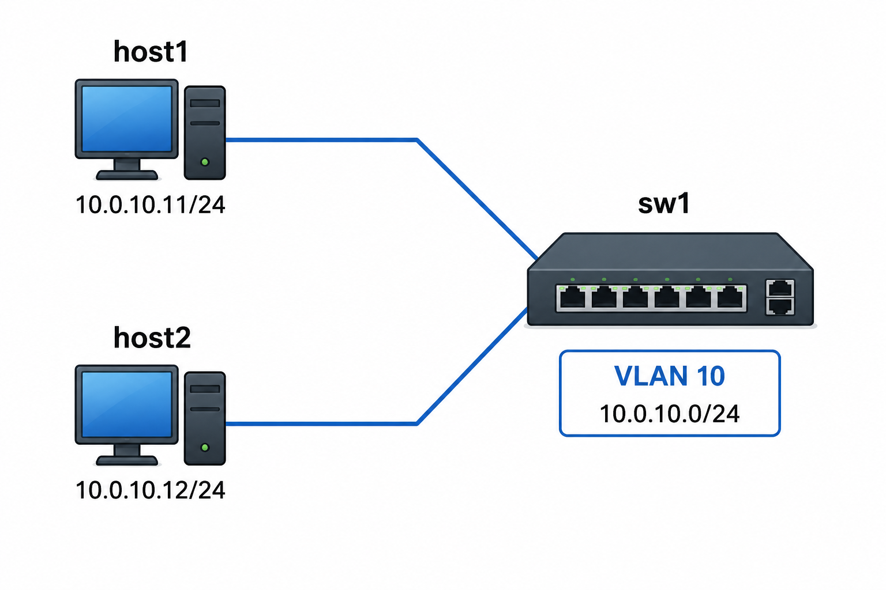

# Lab 1: L2 Fundamentals

*Assumes the lab server (root). Build `nettools:week03` in the [Docker Lab](../tools/docker) first — both hosts below use it.*

This is your first Containerlab topology. It's deliberately small — one switch, two hosts, one subnet — so you can focus on *how Containerlab works* as much as on the L2 concepts themselves. Each step below is fully worked: expand the "Show me" boxes for the exact file/commands, but read the explanation and follow the links first if a step is new to you.

## Topology



- `sw1` is **Arista cEOS**, configured as a pure L2 access switch — both connected ports in VLAN 10.
- `host1` and `host2` are `nettools:week03` containers, both on the same subnet/VLAN.

This is the simplest possible topology: one broadcast domain, no routing. Everything you validate here is L2.

## Containerlab basics

A quick orientation, since this is your first lab:

- A **topology file** (`*.clab.yml`) declares the nodes (containers/VMs) and the links between their interfaces. Containerlab reads this file and wires everything up for you — interfaces, virtual links, the lot.
- `containerlab deploy -t <file>` builds the topology; `containerlab destroy -t <file> --cleanup` tears it down completely.
- Each node becomes a container named `clab-<lab-name>-<node-name>`, where `<lab-name>` is the `name:` field in the topology file. You interact with nodes mostly via `docker exec`.

Skim the [Containerlab quickstart](https://containerlab.dev/quickstart/) before starting — it walks through all of this with a worked example.

## Step 0: Prepare the work directory
On the ContainerLab host create a directory structure in your home directory that can grow as you work with ContainerLab. Each deployment in ContainerLab needs to reside in its own folder on the filesystem.

`mkdir -pv $HOME/container-lab/week03/lab{1..3}`

`cd` to `$HOME/container-lab/week03/lab1`

## Step 1: Write the topology file

A topology file has two main parts under `topology`: `nodes` (each with a `kind` — `linux` or `arista_ceos` here — and an `image`) and `links` (pairs of `node:interface` endpoints). See the [topology definition reference](https://containerlab.dev/manual/topo-def-file/) for the full schema, and the [cEOS kind reference](https://containerlab.dev/manual/kinds/ceos/) for `sw1` specifically. Confirm the cEOS image tag on your lab server with `docker images | grep ceos` and use that tag below.

In `$HOME/container-lab/week03/lab1` create a topology YAML file for this lab named `lab1.clab.yaml`.

<details>
<summary>Show <code>lab1.clab.yml contents</code></summary>

```yaml
name: week03-lab1
topology:
  nodes:
    host1:
      kind: linux
      image: nettools:week03
      exec:
        - ip addr add 10.0.10.11/24 dev eth1
    sw1:
      kind: arista_ceos
      image: ceos:4.36.0.1F
    host2:
      kind: linux
      image: nettools:week03
      exec:
        - ip addr add 10.0.10.12/24 dev eth1
  links:
    - endpoints: ["host1:eth1", "sw1:eth1"]
    - endpoints: ["sw1:eth2", "host2:eth1"]

```

*I have already imported the `ceos:4.36.0.1F` container. You can validate this container is present for Docker with `docker image ls | grep ceos`.*

</details><br />

## Step 2: Deploy the ContainerLab

Run `containerlab deploy -t lab1.clab.yml` in the directory with the YAML file you created.

The [`deploy`](https://containerlab.dev/cmd/deploy/) instruction for ContainerLab converts the input YAML file into a combination of Docker networks and Docker containers, then starts all the components. When successful, it will print a summary table of the three nodes for this lab, their current status, and their management IPs once they're up. 

It is not guaranteed that all nodes defined in your YAML will be fully ready for use at the end of the `deploy`. command. You can use [`containerlab inspect`](https://containerlab.dev/cmd/inspect/) at anytime to print an updated summary of the lab status. 

*The Arista switch container `clab-week03-lab1-sw1` takes the longest to boot — wait until its state shows `running` before continuing.*

## Step 3: Get a shell on each Linux node

**Open 3 SSH windows to the ContainerLab host.** This way you can keep interactive shells available on all devices in the lab without having to exit back to the Docker host to change which container you are interacting with. 

*Hint: You could alternatively use a terminal multiplexer like Tmux so that you can have multiple tabs open in your terminal instead of multiple terminals. [Here is a Tmux tutorial if you are interested.](https://hamvocke.com/blog/a-quick-and-easy-guide-to-tmux/)*

- **Linux nodes** (`clab-week03-lab1-host1`, `clab-week03-lab1-host2`): run commands directly with `docker exec`, e.g. `docker exec -it clab-week03-lab1-host1 bash` for an interactive shell, or prefix a single command (such as `docker exec clab-week03-lab1-host1 hostname`).

## Step 4: Validate Linux hosts

- **Ping `clab-week03-lab1-host1` → `clab-week03-lab1-host2`:**

  ```bash
  docker exec -it clab-week03-lab1-host1 ping -c 3 10.0.10.12
  ```

  This should just work, though it can take up to a minute after `deploy` before the switch is in a state to forward traffic. If it does not work, give it a minute or so and repeat.

- **ARP table on the hosts** — after the ping:

  ```bash
  docker exec -it clab-week03-lab1-host1 ip neigh
  docker exec -it clab-week03-lab1-host2 ip neigh
  ```

  Each host should have an entry for the other host on `dev eth1`.  

  *Question: ARP entries, like DNS records, have an equivalent of a Time To Live: a period of time during which an entry is cached. Wait a moment or two and rerun the `ip neigh` and the state field (the last field in the output, in all caps) should change. What states can ARP entries have, and what do they mean? [ARP Man Page](https://man7.org/linux/man-pages/man8/ip-neighbour.8.html)*

- **LLDP neighbor tables** — every link in your topology should show up as an LLDP neighbor on *both* ends:
  - On `sw1`: `show lldp neighbors` — should list `host1` and `host2`.
  - On the hosts:

    ```bash
    docker exec -it clab-week03-lab1-host1 lldpcli show neighbors ports eth1
    docker exec -it clab-week03-lab1-host2 lldpcli show neighbors ports eth1
    ```

  *Question: If you instead show the LLDP neighbors on the `eth0` interface of one of the Linux hosts what do you see that is different from the neighbors on `eth1`? What are these fields telling you? The goal isn't to understand every field of output, but to narrow in on the ones that change.*

## Step 5: Your first switch commands

The `clab-week03-lab1-sw1` node runs the [Arista EOS](https://www.arista.com/en/um-eos/eos-overview) Network Operating System. This is the first time you will interact directly with a switch OS.

- **Get a console on the switch node**: `docker exec -it clab-week03-lab1-sw1 Cli`. This will put you in a minimally-functional command prompt that should be `sw1>`. You can use `?` to print a list of all commands available in this state.

- **Enable privileged access in the CLI**: In the `sw1>` command prompt enter `enable`. Your command prompt will enter an elevated access state and change to `sw1#`. Use `?` again and you will see a huge list of new commands have been made available. In switch terms this is similar to using `sudo bash` on a Linux system.

- **Inspect LLDP from the switch side**: In the `sw1#> prompt use:

    ```bash
    show lldp neighbors
    ```

  This prints much of the same information you've already seen from the Linux side. Each line shows you the local port on the switch and the neighbors name and MAC address.

  *The `show lldp neighbors` command has a variety of possible arguments. You an use `?` after any part of a command in EOS to see what options are available for the command. Try entering `show lldp neighbors ?` and you should see that the next word could be Ethernet, Management, or detail. 

  *Experiment: Play around with the command prompt as much as you would like. Can you work out the command to show detailed LLDP information for the `Ethernet 1` port? The `show` command has a huge number of options.*

- **Print the MAC table on `clab-week03-lab1-w1`** — from the EOS CLI run  
  ```bash
  show mac address-table
  ```

  *Question: If the MAC address table is empty what would this tell you? If it is indeed empty, if you `exit` until you are back on the ContainerLab host, rerun `docker exec -it clab-week03-lab1-host1 ping -c 3 10.0.10.12` then check the mac address-table of the switch what does it show now?*

  *Question: For each table: what triggered the entry (a ping? an LLDP advertisement?), and what would happen to connectivity or topology discovery if that entry were missing?*

## Step 6: Clean up

```bash
containerlab destroy -t lab1.clab.yml --cleanup
```

This removes the containers and any state Containerlab created. `lab1.clab.yml` itself is untouched, so you can redeploy any time.
