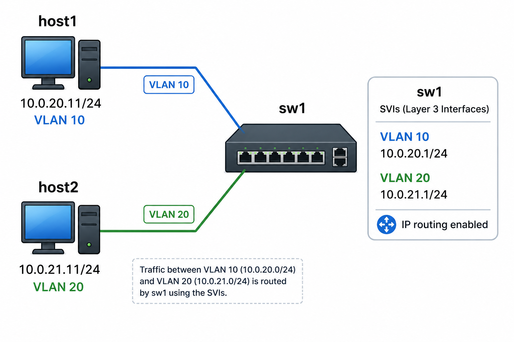

# Lab 2: The L2/L3 Pivot

*Assumes the lab server (root), and that you've completed [Lab 1](./lab1) — this lab reuses the same workflow (work directory, topology file, `deploy`, `docker exec`) without re-explaining it. Build `nettools:week03` in the [Docker Lab](../tools/docker) first if you haven't already.*


This lab uses the same topology as Lab 1: two Linux hosts with one switch. Each Linux host has the `eth1` interface connected to the switch. The difference in this lab is that the Linux hosts `eth` IP addresses are in **separate** subnets. Because of this, there is **no Layer 2 adjacency** between the two Linux hosts `eth1` interfaces (each host is now in its own network).

This lab reconstructs Lab 1 with the requirement that the switch device forward traffic between the two networks rather than directly switching traffic between ports.

To facilitate this we make use of VLANs (Virtual Local Area Networks) to represent each network and enable `ip routing` within the switch to enable forwarding. We also add static routes to each host to instruct them on how to reach the other hosts network.

The key new concept is the **SVI (Switch Virtual Interface)**: a virtual, routed Layer 3 interface bound to a VLAN. Where `Ethernet1`/`Ethernet2` are physical access ports that switch frames within a single VLAN, an SVI (`Vlan10`, `Vlan20`) gives `sw1` an IP address *on* that VLAN's subnet and acts as the gateway for hosts in that VLAN. A switch with SVIs and `ip routing` enabled can switch within a VLAN *and* route between VLANs — that combination is the L2/L3 pivot this lab is about.

*This may be quite confusing at first. The SVI represents a virtual interface. In this case the SVI is a virtual interface attached to a VLAN and configured with an IP address. This gives the switch a **presence** on the VLAN rather than just making it aware of the VLAN.*

## Topology



- `host1`'s gateway is `sw1`'s `Vlan10` SVI (`10.0.20.1`).
- `host2`'s gateway is `sw1`'s `Vlan20` SVI (`10.0.21.1`).
- Unlike Lab 1, `sw1` needs real configuration before anything works — this lab is where you'll do your first `configure` session on cEOS.

## Step 0: Prepare the work directory

If you followed Lab 1's Step 0, you already have `$HOME/container-lab/week03/lab2`. `cd` there now:

```bash
cd $HOME/container-lab/week03/lab2
```

(If you skipped Lab 1, run `mkdir -pv $HOME/container-lab/week03/lab{1..3}` first.)

## Step 1: Write the topology file

Same shape as Lab 1's `lab1.clab.yml` — three nodes, two links — but `host1`/`host2` now get addresses in *different* subnets, each with a default route pointing at its SVI gateway on `sw1`. As in Lab 1, the `exec:` block runs those commands inside each host automatically when the container starts, so the hosts are pre-addressed the moment `deploy` finishes. (The route to the gateway will just sit unused until you configure `sw1` in Step 4 — that's fine.)

<details>
<summary>Show <code>lab2.clab.yml</code> contents</summary>

```yaml
name: week03-lab2
topology:
  nodes:
    host1:
      kind: linux
      image: nettools:week03
      exec:
        - ip addr add 10.0.20.11/24 dev eth1
        - ip route add 10.0.21.0/24 via 10.0.20.1 dev eth1
    sw1:
      kind: arista_ceos
      image: ceos:4.36.0.1F
    host2:
      kind: linux
      image: nettools:week03
      exec:
        - ip addr add 10.0.21.11/24 dev eth1
        - ip route add 10.0.20.0/24 via 10.0.21.1 dev eth1
  links:
    - endpoints: ["host1:eth1", "sw1:eth1"]
    - endpoints: ["sw1:eth2", "host2:eth1"]
```

Same `ceos:<version>` note as Lab 1 — confirm the tag with `docker images | grep ceos` and adjust if needed.

</details><br />

## Step 2: Deploy

```bash
containerlab deploy -t lab2.clab.yml
```

Same as Lab 1: wait until `clab-week03-lab2-sw1` shows `running` in the summary table (or re-check with `containerlab inspect -t lab2.clab.yml`). At this point `host1` and `host2` are addressed and have default routes pointing at gateways that don't exist yet — `sw1` hasn't been configured.

## Step 3: Get a shell on each node

Open 3 SSH windows to the ContainerLab host or make use of Tmux. Then, like in Lab 1, open a shell in each container:

- **Linux hosts**: `docker exec -it clab-week03-lab2-host1 bash` (or prefix a single command).
- **cEOS (Enabled shell)**: `docker exec -it clab-week03-lab2-sw1 Cli`, then `enable` to get the `sw1#` prompt.

## Step 4: Configure `sw1` — VLANs, SVIs, and `ip routing`

This is the core of the lab. From `sw1#`, enter configuration mode with `configure`. When you are in configuration mode your prompt will change to `sw1(config)#`. Switch configuration is frequently nested like a directory structure. For example, when you work through part 1, after typing `vlan 10` your command prompt will change to `sw1(config-vlan-10)#`, indicating that your shell is currently scoped to configuration of vlan 10 specifically. `exit` will take you up one step, in this instance it would return you to the root `sw1(config)#` prompt.

*This behavior might take some time to get used to, but once you are familiar with it you will be able to quickly know what part of the configuration system you are scoped to, what can be changed, and how to change between scopes easily.*

**Everything below is one continuous config session. Go through it piece by piece by typing rather than pasting it all at once, so you can see what each part does.** Make frequent use of `?` as you work through commands so you can see what parts have various options. 

*I would recommend never trying to memorize what is available for any command. `?` will show you all the valid options.*

1. **Create the two VLANs** 

   A VLAN has to exist in the switches configuration before anything else can reference it. Begin by defining VLANs 10 and 20.

   ```bash
   vlan 10
   vlan 20
   exit
   ```

   *Hint: Your prompt will update after you define each vlan. The `exit` returns you to the base `sw1(config)#` prompt.*

   **Inspect the VLANs you just created**  
   Use `show vlan` to print a table of all VLANs that have been defined in the switch. You will see that VLAN 1 is pre-defined with the name `default`. This is a special default vlan that comes pre-defined on essentially all Layer 3 capable switches. Let's be sure to chat about this  so it's not confusing.

2. **Assign the access ports.**
   `host1`'s link is defined in the lab2.clab.yml file as connecting from `host1:eth1` to `sw1:eth1`. On the switch, we need to place the switches `Ethernet1` interface into VLAN 10. Similarly, we need to place the switches `Ethernet2` interface into VLAN 20.

   From the `sw1(config)#` prompt, do the following:

   ```
   interface Ethernet1
      switchport access vlan 10
   interface Ethernet2
      switchport access vlan 20
   exit
   ```

   *Hint: The `interface EthernetX` command will scope your configuration prompt to only affect that interface.*

3. **Create the SVIs.** An SVI is a *virtual* interface on the switch that is bound to a VLAN. It's the switch's "presence" on that VLAN, and it's what lets the switch route traffic into and out of that VLAN. It's configured exactly like any other interface (see the [EOS IPv4 guide](https://www.arista.com/en/um-eos/eos-ipv4)), just named `Vlan<n>` instead of `Ethernet<n>`. These addresses are the gateways `host1`/`host2` are already configured to use for routing from the lab2.clab.yml file.

   ```
   interface Vlan10
      ip address 10.0.20.1/24
   interface Vlan20
      ip address 10.0.21.1/24
   exit
   ```

4. **Enable `ip routing`.** This is the global switch that turns on L3 forwarding. *It is off by default on EOS/cEOS.* Without it, `sw1` will still answer pings to its own SVI addresses (that's just local processing — the packet never needs to be forwarded), but it will **not** forward traffic between VLANs. If Step 5's cross-VLAN ping fails but pinging the SVIs themselves works, this is the first thing to check.

   ```
   ip routing
   ```

5. **Exit configuration mode and save**
Exit from configuration mode back to enable mode and save the configuration you have applied to be persistent.

   ```
   end
   write
   ```

<details>
<summary>Show the full <code>sw1</code> configuration as one block</summary>

```
configure
vlan 10
vlan 20
interface Ethernet1
   switchport access vlan 10
interface Ethernet2
   switchport access vlan 20
interface Vlan10
   ip address 10.0.20.1/24
interface Vlan20
   ip address 10.0.21.1/24
ip routing
end
write
```

</details><br />

## Step 5: Validate

- **Ping `host1` → `host2`:**

  ```bash
  docker exec -it clab-week03-lab2-host1 ping -c 3 10.0.21.11
  ```

  The difference between this lab and lab 1 is that the path between the Linux hosts `eth1` interfaces is no longer handled by ARP and Layer 2. Instead, each host has what is called a "static route" that instructs it to use `sw1` to get to the other hosts network. This is the pivot from Layer 2 to Layer 3 for providing a path between devices.

- **MAC table on `sw1`** — from the EOS CLI: `show mac address-table`. Both hosts' MACs should still be there.

  *Question: why would the MAC table on the switch have entries for both hosts, even though `host1 → host2` traffic is now routed instead of switched? What does that tell you about how `sw1` is forwarding this traffic? Is L2 switching happening at all, or is something else going on?*

- **Routing table on `sw1`** — from the EOS CLI: `show ip route`. You should see `C` (connected) routes for `10.0.20.0/24` on `Vlan10` and `10.0.21.0/24` on `Vlan20`. This is the first routing table you've seen on a device that's *also* a switch.

- **ARP table on the hosts** — after the ping:

  ```bash
  docker exec -it clab-week03-lab2-host1 ip neigh
  docker exec -it clab-week03-lab2-host2 ip neigh
  ```

  Each host should resolve the SVI MAC for its VLAN as its default gateway (`10.0.20.1` / `10.0.21.1`).

Hopefully there is a bit of an "aha" here: Each Linux host only shows one neighbor in its ARP table: `sw1`.

## Step 6: Clean up

```bash
containerlab destroy -t lab2.clab.yml --cleanup
```

## Step 7: Wireshark — the same packet, two L2 frames

In this directory are two PCAP files that I generated: [host1.pcap](../_file/data/host1.pcap) and [host2.pcap](../_file/data/host2.pcap). These should be openable with Wireshark and you can see 5x ICMP echo (ping) requests and responses from the viewpoint of each host in the lab — `host1.pcap` was captured on `host1`'s `eth1`, `host2.pcap` on `host2`'s `eth1`.

Open both, and pick the same echo request/reply pair in each (e.g. `seq=1`).

- **Compare the IP layer** ("Internet Protocol Version 4" Source/Destination) between the two captures. What do you notice?
- **Compare the Ethernet layer** ("Ethernet II" Source/Destination) between the two captures. What do you notice this time?
- One MAC address shows up in *both* captures, once as a destination, once as a source. Whose interface is that, and why does it appear in both?

This is the L2/L3 pivot, frame by frame: the IP addresses are identical end-to-end — `host1` and `host2` never stop talking to each other at Layer 3 — but the Ethernet addressing is rewritten at every L3 hop. `sw1`'s SVI is that hop: it receives a frame addressed to *it*, and sends out a new frame — same IP packet inside but now addressed to the other host. Re-read Step 5's "aha" with this in mind.

This is the general pattern for *every* router, not just `sw1`'s SVIs. At each hop a router:

1. Receives an L2 frame addressed (at L2) to **its own MAC address**.

2. Strips the L2 header and looks at the L3 packet inside — specifically the **destination IP address**.

3. Looks up that destination IP in its **routing table** to determine the next hop (and the outgoing interface).

4. Rebuilds the frame with a **new L2 header**: source MAC is the router's outgoing interface, destination MAC is the *next hop's* MAC (either another router, or the final destination host if it's on a directly connected network).

The IP packet (source/destination IP, mostly) survives unchanged end-to-end; the Ethernet frame around it is discarded and rebuilt at every hop. That's why the IP layer matched between `host1.pcap` and `host2.pcap` but the Ethernet layer didn't.

Lab 3 will explore capturing and understanding this cycle on a multi-hop path.