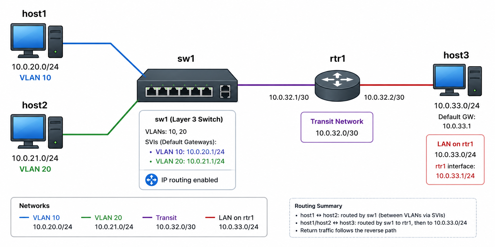

# Lab 3: Extended Topology

# THIS LAB IS STILL UNDER CONSTRUCTION

## Topology

- Everything from Lab 2 stays: `sw1` is still an L3 switch with two SVIs serving `host1` and `host2`.
- Add `rtr1` — another cEOS instance, configured purely as a router (routed interfaces, no VLANs) — and `host3`, a third `nettools:week03` host on its own subnet.
- A new **transit link** connects `sw1` and `rtr1` directly: a routed point-to-point link, `10.0.32.0/30`.

Neither `sw1` nor `rtr1` knows about the other's subnets automatically — you'll add **static routes** on each side.

## Build it

- Extend your Lab 2 `.clab.yml`: add `rtr1` (`kind: arista_ceos`, same image as `sw1`) and `host3` (`nettools:week03`).
- Add links: `sw1` ↔ `rtr1`, and `rtr1` ↔ `host3`.

## Configure

- On `sw1`: configure the new interface toward `rtr1` as a **routed port** (`no switchport`, IP `10.0.32.1/30`) — alongside the VLANs/SVIs from Lab 2, which stay as they are.
- On `rtr1`: enable `ip routing`; configure the interface toward `sw1` as a routed port (`10.0.32.2/30`), and the interface toward `host3` as a routed port (`10.0.33.1/24`).
- On `host3`: assign an address in `10.0.33.0/24`, default route via `rtr1` (`10.0.33.1`).
- **Static routes** — two separate routes on each side, don't summarize:
  - On `sw1`: a route to `10.0.33.0/24` via `10.0.32.2` (`rtr1`).
  - On `rtr1`: a route to `10.0.20.0/24` via `10.0.32.1` (`sw1`), and a *separate* route to `10.0.21.0/24` via `10.0.32.1` (`sw1`).
- The [EOS IPv4 guide](https://www.arista.com/en/um-eos/eos-ipv4) covers static route configuration (`ip route <prefix> <next-hop>`), and the [EOS LLDP guide](https://www.arista.com/en/um-eos/eos-link-layer-discovery-protocol) is the same one you've already used for `lldp run` on `rtr1`.

## Validate

- **`host1` ↔ `host2` still works exactly as in Lab 2** — that traffic never leaves `sw1`. Confirm it still does before moving on.
- **`host1` (or `host2`) ↔ `host3`** now requires a multi-hop path: `host1` → `sw1` (via its SVI) → `sw1`'s static route → `rtr1` → `rtr1`'s routed interface → `host3`. Ping it and watch it work.
- **Routing tables on `sw1` and `rtr1`** (`show ip route`) — you should now see both `C` (connected) and `S` (static) routes side by side. On `rtr1`, the two static routes to `10.0.20.0/24` and `10.0.21.0/24` are separate entries — notice they're adjacent `/24`s, and think about whether (and when) summarizing them into one `/23` route would make sense.
- **LLDP neighbor tables** — the new `sw1`↔`rtr1` and `rtr1`↔`host3` links should show up just like the Lab 1/2 links did.

This is the full picture: one device (`sw1`) doing L2 switching *and* inter-VLAN routing, a second device (`rtr1`) doing pure L3 routing, and static routes connecting the two routing domains — the L2→L3 pivot, extended to a real multi-device topology.

**Supplement once gear access lands:** SSH/console into a **real read-only Flatiron switch** and find the same tables — MAC, ARP, routing — on production hardware. Compare the shape of the output to your lab. Seeing the model and the reality side by side is the point.

*Stuck?* `clab_lab3.md` in this directory has a fully worked version of this topology — topology file, configs, and all — but try the docs above first.
