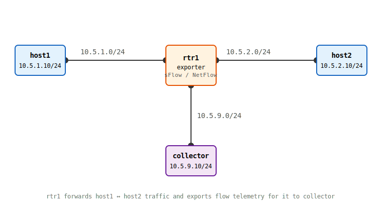

# Lab 1: sFlow — Sampling and Estimation

**Before proceeding, complete [Lab 0](./lab0) to build `nettools:week05`.**

This lab builds the topology every Week 5 lab reuses: `host1` and `host2` talk to each other through `rtr1`, which routes between them and exports flow telemetry for the traffic it forwards. Here, `rtr1` runs `hsflowd`, sampling a pseudorandom 1-in-*N* packet crossing one of its transit interfaces and shipping raw samples to `collector`. You'll decode those samples, extrapolate a traffic estimate, and check it against `rtr1`'s own exact interface counters.

**This lab should be done on the lab host configured for you to have privileged access to.**

## Topology



- `rtr1` is a `nettools:week05` Linux container with `ip_forward` enabled, routing between `10.5.1.0/24` and `10.5.2.0/24`. `hsflowd` samples only `eth1` — a single tap on either transit interface already sees the *entire* `host1↔host2` conversation in both directions, since every packet routed between them crosses both interfaces anyway. (Tapping both would just sample the same forwarded packets twice, once per interface — see the note after the config below.)
- `collector` is a `nettools:week05` container on its own subnet (`10.5.9.0/24`), reachable directly from `rtr1`'s `eth3`.

## Step 0: Prepare the work directory

```bash
mkdir -p $HOME/container-lab/week05/lab1
cd $HOME/container-lab/week05/lab1
```

## Step 1: Write the topology file

<details>
<summary>Show <code>lab1.clab.yml</code> contents</summary>

```yaml
name: week05-lab1
topology:
  nodes:
    host1:
      kind: linux
      image: nettools:week05
      exec:
        - ip addr add 10.5.1.10/24 dev eth1
        - ip route add 10.5.2.0/24 via 10.5.1.1 dev eth1
        - ip link set dev eth1 mtu 1500
    rtr1:
      kind: linux
      image: nettools:week05
      exec:
        - ip addr add 10.5.1.1/24 dev eth1
        - ip addr add 10.5.2.1/24 dev eth2
        - ip addr add 10.5.9.1/24 dev eth3
        - sysctl -w net.ipv4.ip_forward=1
        - ip link set dev eth1 mtu 1500
        - ip link set dev eth2 mtu 1500
        - ip link set dev eth3 mtu 1500
    host2:
      kind: linux
      image: nettools:week05
      exec:
        - ip addr add 10.5.2.10/24 dev eth1
        - ip route add 10.5.1.0/24 via 10.5.2.1 dev eth1
        - ip link set dev eth1 mtu 1500
    collector:
      kind: linux
      image: nettools:week05
      exec:
        - ip addr add 10.5.9.10/24 dev eth1
        - ip link set dev eth1 mtu 1500
  links:
    - endpoints: ["host1:eth1", "rtr1:eth1"]
    - endpoints: ["rtr1:eth2", "host2:eth1"]
    - endpoints: ["rtr1:eth3", "collector:eth1"]
```

</details><br />

## Step 2: Deploy

```bash
containerlab deploy -t lab1.clab.yml
```

Validate basic reachability before adding telemetry — `host1` should be able to reach `host2` through `rtr1`:

```bash
docker exec -it clab-week05-lab1-host1 ping -c 3 10.5.2.10
```

## Step 3: Configure the sFlow agent on `rtr1`

*Note: The configuration file for `hsflowd` already exists. You should either delete it with `rm /etc/hsflowd.conf` or remove the contenst with `echo > /etc/hsflowd.conf` before continuing.*

```bash
docker exec -it clab-week05-lab1-rtr1 sh
```

Inside `rtr1`, write `/etc/hsflowd.conf`:

<details>
<summary>Show <code>hsflowd.conf</code> contents</summary>

```
sflow {
  polling = 30
  sampling = 1000
  sampling.bps_ratio = 0
  collector { ip = 10.5.9.10  udpport = 6343 }
  pcap { dev = eth1 }
}
```

</details>

The top-level `polling`/`sampling` lines only set the *defaults* counter-polling and any unconfigured interface would fall back to. They do **not** by themselves turn any interface into a packet-sampling source — `hsflowd` auto-discovers interfaces for counter polling, but actual packet sampling (the `PCAP` module this build includes) only samples interfaces you list explicitly. The `pcap { dev = eth1 }` block is what actually makes `eth1` get sampled; without it, `hsflowd` runs and polls counters, but never sends a single packet-flow-sample.

**`sampling.bps_ratio = 0`** matters more than it looks. By default, `hsflowd` doesn't actually use the configured `sampling = N` for an interface where it can detect a link speed. Instead, it *computes* a rate as `N = speed_in_bps / bps_ratio`, with `bps_ratio` defaulting to 1,000,000 (so effectively `N = speed_in_Mbps`). 

Start the agent and exit the container:

```bash
hsflowd  
exit
```

**Question**: *The `rtr1` node has a total of 3 interfaces: one connected to `host1`, one connected to `host2`, and one connected to `collector`. Why is the configuration above only enabling sampling on `eth1`? Why not enable it on `eth1` and `eth2`? Would you gain any additional information with both host-facing interfaces being sampled?*

## Step 4: Start the collector

Take an initial reading of how many packets and bytes have transited the interface that is being captured:

```bash
docker exec -it clab-week05-lab1-rtr1 ip -s link show eth1
```

*Note: This command shows you a lot of valuable information. Things like packet counts, errors, drops... these are all great for troubleshooting issues in real systems.*

*Double Note: Remember that all network connections contain a minimum of two channels: Rx which **receives** data on the link, and Tx which **transmits** data.*

Even at conservative sampling rates, a sustained `iperf3` run will produce thousands of samples per minute, far too many to read as they scroll by. Log them to a file on `collector` instead, and run `goflow2` in the background:

```bash
docker exec -it clab-week05-lab1-collector mkdir -p /data
docker exec -d clab-week05-lab1-collector goflow2 -listen sflow://:6343 -format json -transport.file /data/lab1-samples.jsonl
```

`-transport.file` writes the same one-JSON-object-per-line output `goflow2` would otherwise print to stdout into that file instead — it'll sit empty (or not exist yet) until the first sample arrives, so there's nothing to inspect until after traffic is actually flowing in Step 5. *Run `goflow2 -h` to confirm `-listen`/`-transport.file` syntax for your installed version.*

## Step 5: Generate traffic and capture ground truth

Start an `iperf3` server on `host2` and run a sustained transfer from `host1`:

```bash
docker exec -d clab-week05-lab1-host2 iperf3 -s
docker exec -it clab-week05-lab1-host1 iperf3 -c 10.5.2.10 -t 60 -i 10
```

After that runs, capture **ground truth** directly from `rtr1`'s own interface counters — this is the exact packet/byte count for the same population the sFlow samples are drawn from:

```bash
docker exec -it clab-week05-lab1-rtr1 ip -s link show eth1
```

Record the `RX`/`TX` packet count for `eth1` before and after the `iperf3` run; the difference is your ground truth packet count for this transfer.

## Step 6: Estimate from samples and compare

As stated before, even at conservative sample rates this test will generate thousands of samples. Get a count of how many packets were sampled:

```bash
docker exec -it clab-week05-lab1-collector sh -c 'wc -l /data/lab1-samples.jsonl'
```

Use the following command to see the structure of a single sFlow sample from your test:

```bash
docker exec -it clab-week05-lab1-collector sh -c 'head -1 /data/lab1-samples.jsonl | jq'
```

Now that traffic has actually run, each sample should be one JSON object (a packet-flow-sample, `"type":"SFLOW_5"`) with fields including `sampling_rate`, `bytes`, `packets`, `src_addr`, `dst_addr`.

`nettools:week05` already bakes in `/summarize-flow.py` (see [Lab 0](./lab0)) — a small script that groups samples by direction and extrapolates packet/byte totals from the sampling rate. Run it directly inside the container against the file you just inspected:

```bash
docker exec -it clab-week05-lab1-collector python3 /summarize-flow.py /data/lab1-samples.jsonl
```

The estimator here is the same `K̂ = S · N` idea from the [Sampling Estimator](./sampling-estimator), just applied per-direction and to bytes as well as packets: each sample already carries its own packet's actual size in `bytes`, so summing that *per sample* before multiplying by the sampling rate (`est_bytes = sum(bytes) × rate`) is more accurate than assuming every packet is the same size — which matters here, since `host1 -> host2` is full-size data segments and `host2 -> host1` is mostly small ACKs.

Compare `est_packets` for `host1 -> host2` against the exact count from Step 5.

*Before you compute this, predict the expected error using the [Sampling Estimator](./sampling-estimator) — plug in your sampling rate and the rough traffic volume from Step 5, and compare the bound it predicts against what you actually measured here.*

**Questions:**
- How close is your estimate to ground truth? Is the gap inside or outside the bound the Sampling Estimator predicted?
- How different are the `est_bytes`/`est_packets` figures for the two directions? Does that match what you'd expect from one direction carrying data and the other carrying mostly ACKs?
- `polling = 30` independently pushes counter samples every 30 seconds, regardless of packet sampling — these show up in the same file as `"type"` values other than `SFLOW_5` (the script above skips them). Find one and look at its fields — does it match `ip -s link show eth1` more closely than the packet-sample extrapolation does? Why would that be, given counter sampling isn't actually a sample at all?

## Step 7: Vary the sampling rate

Use the following procedure to stop `hsflowd` and `goflow2`, modify the sampling rate to a very high rate of 1 in 100, then restart `hsflowd` and `goflow2`.

```bash
docker exec clab-week05-lab1-rtr1 pkill hsflowd
docker exec clab-week05-lab1-rtr1 rm -f /var/run/hsflowd.pid
docker exec clab-week05-lab1-collector pkill goflow2
docker exec clab-week05-lab1-collector rm -f /data/lab1-samples.jsonl
docker exec clab-week05-lab1-rtr1 sed -i 's/^  sampling = .*/  sampling = 100/' /etc/hsflowd.conf
docker exec -d clab-week05-lab1-rtr1 hsflowd
docker exec -d clab-week05-lab1-collector goflow2 -listen sflow://:6343 -format json -transport.file /data/lab1-samples.jsonl
```

Repeat the iperf3 test from above:

```bash
docker exec -it clab-week05-lab1-host1 iperf3 -c 10.5.2.10 -t 60 -i 10 -R
```

*Note: In this test we add the **-R** flag to iperf3 which reverses the directionality of the test. Instead of testing from `host1` -> `host2`, we now test the opposite.*

Finally, review the summary of the samples using process you did in **Step 6**.

**Questions:**
- How did the number of sFlow datagrams `collector` received change between the sample rates, for roughly the same traffic volume?
- How did your estimation error change? Does the direction of the change match what the Sampling Estimator predicts?
- After comparing your initial test with traffic flowing from `host1` to `host2` to the final test where you reversed the direction, have you changed how you would answer to the question posed in **Step 3** about sampling only one host-facing interface vs sampling both?

## Step 8: Clean up

```bash
containerlab destroy -t lab1.clab.yml --cleanup
```

---

## Optional stretch: sFlow on a real switch

Everything above ran the sFlow agent on a Linux host (`rtr1`) — see [code.md](./code#why-a-linux-host-as-the-exporter-not-a-switch) for why that's a deliberate, realistic choice and not just a workaround.

That said, you now have access to a real high-speed switch in the lab. If you have time we can work together to implement sFlow on that switch reporting to a collector on your workstation. We can also hook it into our existing, production sFlow software.