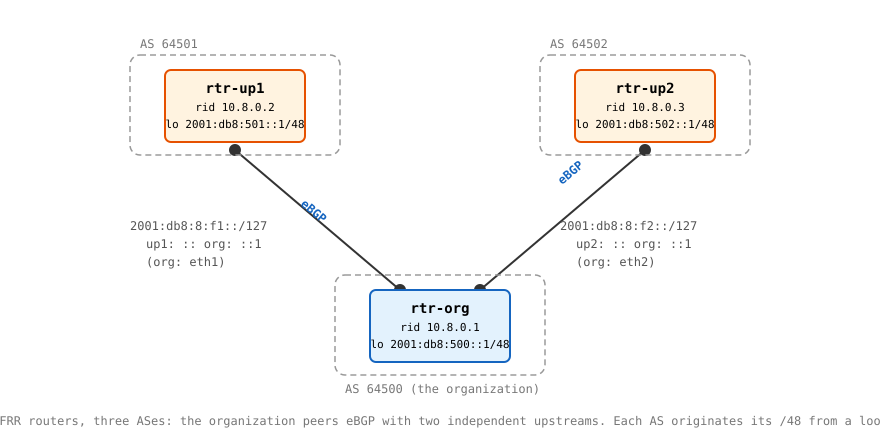

# Lab 1: Your First eBGP Peerings (IPv6)

**Before starting**, complete [Lab 0](./lab0) (FRR image + daemons file) and read the [Basics page](../week_08/objectives); this lab is that page performed live. [Week 7's Lab 1](../week_07/lab1) is assumed throughout, link-local next-hops especially.

Three routers, three autonomous systems. Your router represents the organization; the other two play its upstreams, the way the public Internet and Internet2 will in the production deployment. Unlike previous labs, the routing configuration is not in any file you deploy: you will type the BGP configuration into live routers and watch sessions come up, fail, exchange routes, and withdraw them. Along the way you'll hit two failures on purpose (a session blocked by modern policy defaults, and a session killed by a wrong ASN) and one accident with a name: becoming a transit provider without meaning to.

**This lab should be done on the lab host configured for you to have privileged access to.**

## Topology



Addressing, all from the documentation ranges: prefixes from `2001:db8::/32`, ASNs from 64496-64511 ([RFC 5398](https://datatracker.ietf.org/doc/html/rfc5398)). Router-to-router links get /127s, the point-to-point convention from [RFC 6164](https://datatracker.ietf.org/doc/html/rfc6164): exactly two addresses, `::` and `::1` (and Week 7's compression rules mean `2001:db8:8:f1::` is a perfectly ordinary address whose last four groups are zero). Each AS originates one /48, held as an address on its router's loopback:

| | ASN | Router ID | Originates | Loopback address |
|---|---|---|---|---|
| `rtr-org` | 64500 | 10.8.0.1 | `2001:db8:500::/48` | `2001:db8:500::1/48` |
| `rtr-up1` | 64501 | 10.8.0.2 | `2001:db8:501::/48` | `2001:db8:501::1/48` |
| `rtr-up2` | 64502 | 10.8.0.3 | `2001:db8:502::/48` | `2001:db8:502::1/48` |

| Link | Prefix | Assignments |
|---|---|---|
| org-up1 | `2001:db8:8:f1::/127` | up1 `::`, org `::1` (org `eth1`) |
| org-up2 | `2001:db8:8:f2::/127` | up2 `::`, org `::1` (org `eth2`) |

Router IDs are 32-bit identifiers written in dotted-quad, carried in every OPEN message; nothing IPv4 is routed anywhere in this lab. Set them explicitly: an IPv6-only router has no IPv4 address to derive one from, and a router that can't determine a router ID can't peer.

## Step 0: Prepare the work directory

```bash
mkdir -p $HOME/container-lab/week09/lab1
cd $HOME/container-lab/week09/lab1
cp ../daemons .   # the file written in Lab 0
```

## Step 1: Write the interface configs

One `frr.conf` per router, and note what they contain: hostname, logging, and interface addresses. No `router bgp` block anywhere. The topology comes up addressed but silent, and every BGP statement this week is typed by you into a live router.

<details>
<summary>Show <code>org-frr.conf</code> contents</summary>

```
frr defaults traditional
hostname rtr-org
log stdout informational
!
interface lo
 ipv6 address 2001:db8:500::1/48
!
interface eth1
 ipv6 address 2001:db8:8:f1::1/127
!
interface eth2
 ipv6 address 2001:db8:8:f2::1/127
!
```

</details>

<details>
<summary>Show <code>up1-frr.conf</code> contents</summary>

```
frr defaults traditional
hostname rtr-up1
log stdout informational
!
interface lo
 ipv6 address 2001:db8:501::1/48
!
interface eth1
 ipv6 address 2001:db8:8:f1::/127
!
```

</details>

<details>
<summary>Show <code>up2-frr.conf</code> contents</summary>

```
frr defaults traditional
hostname rtr-up2
log stdout informational
!
interface lo
 ipv6 address 2001:db8:502::1/48
!
interface eth1
 ipv6 address 2001:db8:8:f2::/127
!
```

</details><br />

The `/48` on each loopback does double duty: it gives the ping targets for the end of the lab, and it puts a connected route for the whole /48 into the router's RIB. That second part matters because FRR will only announce a `network` that actually exists in its RIB; the loopback address is what makes the announcement legal.

`frr defaults traditional` is load-bearing too. Among other things it turns on the [RFC 8212](https://datatracker.ietf.org/doc/html/rfc8212) behavior you will collide with in Step 5. Leave it in.

## Step 2: Write the topology file and deploy

<details>
<summary>Show <code>lab1.clab.yml</code> contents</summary>

```yaml
name: week09-lab1
topology:
  nodes:
    rtr-org:
      kind: linux
      image: quay.io/frrouting/frr:10.6.1
      binds:
        - daemons:/etc/frr/daemons
        - org-frr.conf:/etc/frr/frr.conf
      exec:
        - sysctl -w net.ipv6.conf.all.forwarding=1
    rtr-up1:
      kind: linux
      image: quay.io/frrouting/frr:10.6.1
      binds:
        - daemons:/etc/frr/daemons
        - up1-frr.conf:/etc/frr/frr.conf
      exec:
        - sysctl -w net.ipv6.conf.all.forwarding=1
    rtr-up2:
      kind: linux
      image: quay.io/frrouting/frr:10.6.1
      binds:
        - daemons:/etc/frr/daemons
        - up2-frr.conf:/etc/frr/frr.conf
      exec:
        - sysctl -w net.ipv6.conf.all.forwarding=1
  links:
    - endpoints: ["rtr-org:eth1", "rtr-up1:eth1"]
    - endpoints: ["rtr-org:eth2", "rtr-up2:eth1"]
```

</details><br />

The link order is what makes `rtr-org`'s `eth1` face up1 the way the configs assume. Deploy and confirm the addressing landed:

```bash
containerlab deploy -t lab1.clab.yml
docker exec -it clab-week09-lab1-rtr-org ip -6 addr show dev eth1
docker exec -it clab-week09-lab1-rtr-org ip -6 route show
```

The routes are all `connected`: two /127s, the loopback /48, and the management plumbing Week 7 explained. No router knows any prefix it doesn't own. Verify that: ping up1's loopback from org and watch it fail.

```bash
docker exec -it clab-week09-lab1-rtr-org ping -c 2 2001:db8:501::1
```

## Step 3: Configure one side and fail to peer

Enter the org router's CLI:

```bash
docker exec -it clab-week09-lab1-rtr-org vtysh
```

You're in FRR's shell, the dialect ancestor of the Juniper CLI arriving in Week 10; `?` completes at any point. Type the org side of the up1 peering:

```
configure
router bgp 64500
 bgp router-id 10.8.0.1
 bgp log-neighbor-changes
 neighbor 2001:db8:8:f1:: remote-as 64501
 address-family ipv6 unicast
  neighbor 2001:db8:8:f1:: activate
  network 2001:db8:500::/48
 exit-address-family
end
```

Line by line, because every one earns its place: `router bgp 64500` declares which AS this router speaks for. `bgp log-neighbor-changes` is worth the habit even though this lab doesn't lean on it directly: under `frr defaults traditional`, FRR does not log session state transitions (established, reset, a rejected OPEN) at all unless it's set. Every verification step here uses `tcpdump` on the wire instead, which doesn't depend on it, but a real operator would never run without it. `neighbor ... remote-as 64501` is the whole of BGP neighbor discovery; nothing is automatic, and the remote ASN is a claim that will be checked against the peer's OPEN message. `activate` turns the session on for the IPv6 unicast address family specifically (a session and the route families it carries are separate dimensions, straight from [RFC 4760](https://datatracker.ietf.org/doc/html/rfc4760)). `network` states what this AS originates.

Now look at the session:

```
show bgp summary
```

The neighbor sits in `Active`, and it will sit there forever: nobody is answering on the far end. `Active` is the FSM state name for "actively retrying the TCP connection", one of BGP's least intuitive names. Every experienced operator has stared at it. Leave this vtysh open.

**Question:** org is retrying a TCP connection to port 179 on `2001:db8:8:f1::`, where bgpd is running but has no configuration. Predict what happens to each attempt: refused outright, ignored, or accepted and then dropped? Step 4's capture starts before up1 is configured, so if you start it promptly you can watch a retry and check your prediction.

## Step 4: Bring up the far side and watch the session establish

Get a capture running first, so the handshake happens on camera. ContainerLab registers each container as a named network namespace on the lab host, so in a **second terminal on the lab host**:

```bash
sudo ip netns exec clab-week09-lab1-rtr-up1 tcpdump -ni eth1 tcp port 179
```

(If the netns name isn't found, `sudo ip netns list` shows what's registered.) With the capture running, open a third terminal, enter up1's vtysh, and configure its side:

```bash
docker exec -it clab-week09-lab1-rtr-up1 vtysh
```

```
configure
router bgp 64501
 bgp router-id 10.8.0.2
 bgp log-neighbor-changes
 neighbor 2001:db8:8:f1::1 remote-as 64500
 address-family ipv6 unicast
  neighbor 2001:db8:8:f1::1 activate
  network 2001:db8:501::/48
 exit-address-family
end
```

Within seconds the tcpdump window tells the story in order: a TCP handshake, then BGP messages. tcpdump decodes them for you; find the **OPEN** in each direction (carrying each router's ASN, router ID, and hold time), the **KEEPALIVE** acknowledgments, and then... keepalives, every sixty seconds, from here on. Back in either vtysh:

```
show bgp summary
```

State: `Established`. Confirm what OPEN negotiated, from org's vtysh:

```
show bgp neighbors 2001:db8:8:f1::
```

The first lines report the peer's ASN (64501) and router ID (`10.8.0.2`) as learned from its OPEN, and the timers: hold 180, keepalive 60, exactly the defaults the [Basics page](../week_08/objectives) widget models. Ctrl-C the tcpdump when you've seen the rhythm.

## Step 5: Established is not enough

The session is up. So, the routes: each side declared a `network`, so org should have `2001:db8:501::/48` by now. Look, on org:

```
show bgp ipv6 unicast
```

Nothing. Look back at `show bgp summary` more carefully: where a prefix count should be, FRR reports `(Policy)`. This is [RFC 8212](https://datatracker.ietf.org/doc/html/rfc8212) working as designed: an eBGP session with no import policy accepts nothing, and with no export policy announces nothing. The rule exists because the alternative was decades of accidents; a newly configured router that trustingly accepted and re-advertised everything it heard could (and, famously, several times did) announce a large fraction of the Internet through itself. Default-deny turns "forgot the filters" from a global incident into a local inconvenience.

Real import/export policy is Week 9's whole subject. This week, state your intent explicitly on **both** routers. The `router bgp` line has to match each router's own ASN, not a shared value: typing `router bgp 64500` into `up1`'s vtysh (already running under `64501`) doesn't silently do anything odd; FRR refuses it outright with `BGP is already running; AS is 64501`. That refusal is a safety net worth recognizing on sight, not a mistake to route around. On org:

```
configure
router bgp 64500
 no bgp ebgp-requires-policy
end
```

On up1, same idea, different ASN:

```
configure
router bgp 64501
 no bgp ebgp-requires-policy
end
```

Then reset the session so both sides re-evaluate, from org:

```
clear bgp *
```

The session drops to `Idle` and re-establishes; watch `show bgp summary` until the neighbor shows a prefix count of 1 in place of `(Policy)`. Now the table, on org:

```
show bgp ipv6 unicast
```

Two prefixes: `2001:db8:500::/48` (local, empty AS path) and `2001:db8:501::/48` learned from the peer. Inspect the learned one:

```
show bgp ipv6 unicast 2001:db8:501::/48
```

Read it against the Basics page: the AS_PATH is `64501` (one hop, prepended once), and the next-hop field carries **two** addresses, a global and a link-local, exactly as [RFC 2545](https://datatracker.ietf.org/doc/html/rfc2545) specifies for a directly connected peer. Hold that detail for Step 8.

## Step 6: Second upstream, wrong ASN first

The org's second feed. In org's vtysh, add the up2 peering, but with a deliberate typo: declare the neighbor as AS 64501 (up1's number) instead of 64502:

```
configure
router bgp 64500
 neighbor 2001:db8:8:f2:: remote-as 64501
 address-family ipv6 unicast
  neighbor 2001:db8:8:f2:: activate
 exit-address-family
end
```

Then configure up2's side correctly yourself, before reading further: AS 64502, router ID `10.8.0.3`, peer `2001:db8:8:f2::1` in AS 64500, activate, originate its /48, allow the lab's no-policy shortcut.

<details>
<summary>Check your up2 configuration here</summary>

```
configure
router bgp 64502
 bgp router-id 10.8.0.3
 bgp log-neighbor-changes
 neighbor 2001:db8:8:f2::1 remote-as 64500
 no bgp ebgp-requires-policy
 address-family ipv6 unicast
  neighbor 2001:db8:8:f2::1 activate
  network 2001:db8:502::/48
 exit-address-family
end
```

</details><br />

Both sides are now configured, and the session will never establish. Watch it fail on the wire; start a capture on org's link to up2 first, from the lab host:

```bash
sudo ip netns exec clab-week09-lab1-rtr-org tcpdump -ni eth2 tcp port 179
```

Within a few seconds the cycle repeats, and it's readable straight from the packet sizes without needing a decode flag: a TCP handshake, then both sides exchange a 128-byte **OPEN**. up2 answers with a 19-byte packet, a bare **KEEPALIVE** header with no body, accepting what it received. org's very next packet is 23 bytes: the same 19-byte header plus a 1-byte error code, a 1-byte subcode, and 2 bytes of data, exactly the shape of a **NOTIFICATION** carrying `OPEN_ERR`/`BAD_PEER_AS` with the offending AS number attached. org sends that, then immediately sends a **FIN**, tearing the connection down; up2 FIN-ACKs, and the whole exchange retries a few seconds later, forever. up2's OPEN said "I am AS 64502", org's configuration insisted on 64501, and NOTIFICATION is BGP's only answer to a fatal disagreement: state the error code, close the session, try again later. There is no negotiating past it. Ctrl-C the capture once you've watched a full cycle, then fix the org side by restating the claim (re-entering `remote-as` overwrites the old value):

```
configure
router bgp 64500
 neighbor 2001:db8:8:f2:: remote-as 64502
end
```

`show bgp summary` on org now shows **two** Established neighbors. (If the up2 session still shows `(Policy)`, revisit Step 5: the shortcut had to be applied on up2 as well, and `clear bgp *` re-evaluates.)

**Question:** the wrong-ASN failure was caught by a check you got for free. What operational mistakes does `remote-as` being a *verified claim* rather than a learned fact protect the production deployment against?

## Step 7: Read three tables, find the accident

The full system is up. Compare the view from each seat, from the lab host:

```bash
docker exec -it clab-week09-lab1-rtr-org  vtysh -c 'show bgp ipv6 unicast'
docker exec -it clab-week09-lab1-rtr-up1 vtysh -c 'show bgp ipv6 unicast'
docker exec -it clab-week09-lab1-rtr-up2 vtysh -c 'show bgp ipv6 unicast'
```

org holds all three /48s, as it should: its own plus one from each upstream, AS_PATHs `64501` and `64502`. But look at **up1's** table. It holds `2001:db8:502::/48`, a prefix belonging to a network up1 has no link to, with AS_PATH:

```
64500 64502
```

Read that path right to left, the way it was built: 64502 originated the prefix, 64500 learned it and passed it along, prepending itself. Nobody asked org to do that. With policy removed, a BGP speaker's default nature is to tell every peer everything it knows, and org is now advertising each upstream to the other. It has become a **transit provider** between its own ISPs: any traffic up1 sends toward up2's prefix will flow through org's little router, on org's links, at org's expense.

Prove that with the data plane. From up1, ping up2's loopback, sourcing from up1's own loopback so the packet represents real AS-to-AS traffic:

```bash
docker exec -it clab-week09-lab1-rtr-up1 ping -c 3 -I 2001:db8:501::1 2001:db8:502::1
```

It works, and every one of those packets crossed rtr-org. (Try the same ping without `-I`: it times out, and working out why is worth the detour. The echo request arrives at up2 sourced from the `2001:db8:8:f1::` link address, and up2 has no route back to that /127: forward paths and return paths are separate facts, a lesson every traceroute you'll ever read depends on.)

In the real world this accident has a price tag: a dual-homed organization that leaks its upstreams to each other invites arbitrary Internet traffic across its access links. Preventing it is the first thing the Week 9 policy work does.

**Question:** what is the AS_PATH of org's own `2001:db8:500::/48` as seen by up1, and by up2? Predict it, then check.

## Step 8: One route, three tables, and a familiar next-hop

Follow up1's prefix through org's forwarding pipeline, one layer at a time:

```bash
docker exec -it clab-week09-lab1-rtr-org vtysh -c 'show bgp ipv6 unicast 2001:db8:501::/48'
docker exec -it clab-week09-lab1-rtr-org vtysh -c 'show ipv6 route 2001:db8:501::/48'
docker exec -it clab-week09-lab1-rtr-org ip -6 route show 2001:db8:501::/48
```

The first is the BGP table: all known paths, best marked. The second is the RIB: the route wears a `B` and FRR's `[20/0]` notation, administrative distance 20 (eBGP) and metric 0; had a static route for the same prefix existed, its distance of 1 would have won instead. The third is the kernel FIB, the route zebra actually installed, and its next-hop is not the global address from the BGP table's first line. It is an `fe80::` **link-local**, `dev eth1`. The UPDATE carried both next-hop addresses, and for a directly connected peer FRR prefers the link-local when installing, which is exactly the route shape you built by hand in Week 7 Lab 1's Step 6. What you typed then, a protocol maintains now, on a channel that would survive a complete renumbering of every global address in the lab.

## Step 9: Withdraw a route and watch the system react

Routes leave BGP the same way they arrive: in an UPDATE. Restart the Step 4 capture on the org-up1 link (netns `clab-week09-lab1-rtr-up1`, interface `eth1`), then in **up2's** vtysh, stop originating:

```
configure
router bgp 64502
 address-family ipv6 unicast
  no network 2001:db8:502::/48
 exit-address-family
end
```

In the capture: an UPDATE arrives at up1 withdrawing `2001:db8:502::/48`; org passed the bad news along within seconds. Check `show bgp ipv6 unicast` on up1 (the prefix is gone) and re-run Step 7's ping (it now fails). No timers were involved: withdrawal is explicit, immediate, and propagates as far as the advertisement did. Re-add the `network` statement and confirm the prefix returns.

**Question:** contrast this with what happens if up2's router simply loses power. Nothing sends a withdraw. Which timer eventually cleans up, how long does that take at defaults, and what happens to traffic toward `2001:db8:502::/48` in the meantime?

## Step 10: Clean up

```bash
containerlab destroy -t lab1.clab.yml --cleanup
```

---

## Final questions

- Step 5 taught that `Established` proves nothing about routes. List everything that had to be true, beyond an Established session, before a prefix originated on up1 appeared in org's kernel FIB. There are at least four separate facts.
- up1's table shows org's `2001:db8:500::/48` with AS_PATH `64500`. Suppose up1 advertised that route back to org. Trace exactly what org does with it and which rule from the Basics page fires.
- Give the organization a second border router for redundancy, then draw the sessions two ways: once with both routers sharing AS 64500 and peering iBGP, and once with each router in its own private ASN peering eBGP (the shape the production network uses between its edge routers and core switches). What problem does each design have to solve that this lab's single router never faced?
- Every address a route actually forwarded over in this lab was either a /127 link address or a loopback /48. The management network never carried a routed packet. Week 10's Juniper routers will have the same separation with different names; why do production networks keep the management plane's reachability entirely apart from the routed data plane?
